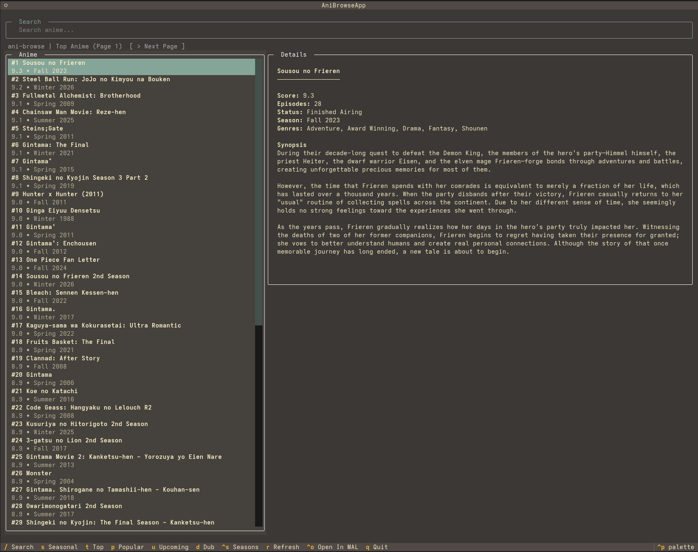

# ani-browse

A fast, keyboard-driven terminal UI to browse anime via MyAnimeList and watch with [`ani-cli`](https://github.com/pystardust/ani-cli).

## Features

- Browse and search anime using MyAnimeList's API
- Play directly with [`ani-cli`](https://github.com/pystardust/ani-cli)

## Preview

<p align="center">
  
</p> 

## Requirements

- Python 3.10+
- [`ani-cli`](https://github.com/pystardust/ani-cli) installed and in your `PATH`
- A MyAnimeList account + API Client ID

## Installation

```bash
pipx install git+https://github.com/soranjiru/ani-browse.git
```

## Development

```bash
git clone https://github.com/soranjiru/ani-browse.git
cd ani-browse
python -m venv .venv
source .venv/bin/activate
pip install -e .
ani-browse
```

## MyAnimeList API Setup

ani-browse requires a **Client ID** from MyAnimeList.

If you don’t have an account, create one first.

### Steps
1. Go to: https://myanimelist.net/apiconfig
2. Click Create ID
3. Fill in the form like this:
 - **App Name:** ani-browse
 - **App Type:** Other
 - **Description:** Personal terminal anime browser
 - **Homepage URL:** http://localhost
 - **App Redirect URL:** http://localhost
 - **Commercial / Non-Commercial:** Non-Commercial
 - **Name / Company Name:** Your name
 - **Purpose of Use:** hobbyist
4. Submit the form
5. Open your app and copy the Client ID

When you start ani-browse, paste that Client ID and press Enter.

## Usage
```bash
ani-browse
```

### Keybindings

| Key      | Action              |
| -------- | ------------------- |
| `/`      | Search              |
| `Esc`    | Exit search         |
| `s`      | Seasonal Anime      |
| `t`      | Top Anime           |
| `p`      | Popular Anime       |
| `u`      | Upcoming Anime      |
| `,`      | Previous page       |
| `.`      | Next page           |
| `[`      | Previous season     |
| `]`      | Next season         |
| `Ctrl+s` | Season picker       |
| `r`      | Refresh Anime       |
| `Ctrl+o` | Open in MyAnimeList |
| `Enter`  | Play with `ani-cli` |
| `d`      | Toggle dub          |
| `q`      | Quit                |
